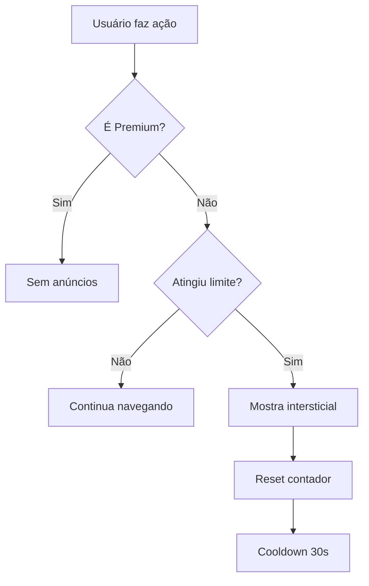

# 📱 Guia de Configuração AdMob - Intercede Together

## ✅ **Migração Concluída: AdSense → AdMob**

A migração foi **100% concluída**! O sistema agora usa AdMob Web SDK com comportamento mobile-first.

## 🔧 **Configuração no Firebase Console**

### 1. **Acessar AdMob Console**
1. Vá para: https://admob.google.com/
2. Faça login com a mesma conta do Firebase
3. **Vincule** com o projeto Firebase `technify-3869a`

### 2. **Criar App Web**
1. No AdMob Console → **Apps** → **Adicionar App**
2. Selecione: **"Não está na loja"** (para web app)
3. **Nome**: "Intercede Together Web"
4. **Plataforma**: Web
5. Copie o **App ID**: `ca-app-pub-XXXXXXXXXX~XXXXXXXXXX`

### 3. **Criar Unidades de Anúncio**

#### 🎯 **Intersticial (Principal)**
- **Nome**: "Intercede Interstitial"
- **Formato**: Intersticial
- **Copie o ID**: `ca-app-pub-XXXXXXXXXX/XXXXXXXXXX`

#### 📱 **Banner Mobile**
- **Nome**: "Intercede Banner"
- **Formato**: Banner
- **Tamanho**: Responsivo
- **Copie o ID**: `ca-app-pub-XXXXXXXXXX/XXXXXXXXXX`

#### 🎁 **Rewarded (Futuro)**
- **Nome**: "Intercede Rewarded"
- **Formato**: Recompensado
- **Copie o ID**: `ca-app-pub-XXXXXXXXXX/XXXXXXXXXX`

## 🔑 **Atualizar Configuração**

### Edite: `src/lib/admob.ts`

```typescript
export const ADMOB_CONFIG = {
  // ⚠️ SUBSTITUA pelos seus IDs reais
  publisherId: "ca-pub-SEU_PUBLISHER_ID_AQUI",
  adUnits: {
    interstitial: "ca-app-pub-SEU_ID/SEU_SLOT_INTERSTITIAL",
    banner: "ca-app-pub-SEU_ID/SEU_SLOT_BANNER", 
    rewarded: "ca-app-pub-SEU_ID/SEU_SLOT_REWARDED"
  },
  testMode: process.env.NODE_ENV !== 'production'
};
```

## 🚀 **Como Funciona Agora**

### **Anúncios Intersticiais Automáticos**
- ✅ **Após postar**: Anúncio imediato após publicar pedido
- ✅ **A cada 3 visualizações**: Anúncio automático no feed
- ✅ **Cooldown**: 30 segundos entre anúncios
- ✅ **Sem anúncios para Premium**: Usuários pagos não veem anúncios

### **Experiência Mobile-First**
- ✅ **Tela cheia**: Anúncios intersticiais nativos
- ✅ **Responsivo**: Banners adaptáveis
- ✅ **UX otimizada**: Timing perfeito para não interromper orações

## 📊 **Fluxo de Anúncios**



## 🎯 **Pontos de Anúncio**

### **1. Feed (useAdControl.trackView)**
```typescript
// A cada visualização de pedido
const { trackView } = useAdControl();

// Chama automaticamente quando necessário
useEffect(() => {
  trackView(); // Conta +1, mostra anúncio se atingir 3
}, [prayerRequestId]);
```

### **2. Publish (useAdControl.trackPost)**
```typescript
// Após publicar pedido
const { trackPost } = useAdControl();

const handleSubmit = async () => {
  await createPrayerRequest(data);
  await trackPost(); // Mostra anúncio imediatamente
};
```

### **3. Sob Demanda (useAdControl.showInterstitialAd)**
```typescript
// Para casos especiais
const { showInterstitialAd } = useAdControl();

const handleSpecialAction = async () => {
  const success = await showInterstitialAd();
  if (success) {
    console.log('Anúncio mostrado com sucesso');
  }
};
```

## 🧪 **Testar Implementação**

### **1. Modo Desenvolvimento**
```bash
npm run dev
```
- Usa IDs de teste do Google
- Anúncios aparecem como "Test Ad"
- Funcionalidade completa

### **2. Modo Produção**
```bash
npm run build
npm run preview
```
- Usa IDs reais (após configurar)
- Anúncios reais do AdMob
- Métricas reais

## ⚙️ **Configurações Avançadas**

### **Lazy Loading**
```typescript
// Já implementado no AdMobWeb.createBannerAd()
// Anúncios carregam apenas quando visíveis
```

### **Controle de Frequência**
```typescript
// Em src/hooks/useAdControl.ts
const AD_TRIGGER_VIEWS = 3; // Altere conforme necessário
const AD_COOLDOWN = 30000; // 30 segundos
```

### **Analytics Integration**
```typescript
// Firebase Analytics já configurado
// Métricas automáticas de anúncios
```

## 🔍 **Troubleshooting**

### **Anúncios não aparecem?**
1. ✅ Verifique se os IDs estão corretos
2. ✅ Confirme que o app foi aprovado no AdMob
3. ✅ Aguarde até 24h após configuração
4. ✅ Teste em modo incógnito

### **Console Errors?**
```javascript
// Verifique no DevTools:
// 1. Network tab - requests para googlesyndication.com
// 2. Console - erros de AdMob
// 3. Application tab - localStorage para ad_control
```

### **Anúncios em teste?**
```typescript
// Para forçar modo teste:
export const ADMOB_CONFIG = {
  testMode: true, // Sempre usar anúncios de teste
  // ...
};
```

## 📈 **Métricas Importantes**

### **No AdMob Console**
- **Impressões**: Quantos anúncios foram mostrados
- **CTR**: Taxa de cliques
- **eCPM**: Receita por mil impressões
- **Fill Rate**: Taxa de preenchimento

### **No Firebase Analytics**
- **ad_impression**: Impressões de anúncios
- **ad_click**: Cliques em anúncios
- **user_engagement**: Engajamento pós-anúncio

## 🚀 **Próximos Passos**

### **1. Configurar IDs Reais** ⚠️
- [ ] Criar conta AdMob
- [ ] Configurar app web
- [ ] Criar unidades de anúncio
- [ ] Atualizar `ADMOB_CONFIG`

### **2. Testar em Produção**
- [ ] Deploy com IDs reais
- [ ] Verificar anúncios carregando
- [ ] Monitorar métricas
- [ ] Ajustar frequência se necessário

### **3. Otimizações Futuras**
- [ ] A/B test da frequência de anúncios
- [ ] Anúncios recompensados (premium temporário)
- [ ] Segmentação por localização
- [ ] Otimização de eCPM

## 💡 **Dicas de Monetização**

### **Maximize Revenue**
1. **Posicionamento**: Anúncios após ações importantes
2. **Frequência**: Balance entre UX e receita
3. **Formatos**: Intersticiais > Banners para mobile
4. **Timing**: Evite interromper momentos de oração

### **Retenção de Usuários**
1. **Cooldown**: Evite spam de anúncios
2. **Premium**: Ofereça alternativa sem anúncios
3. **Recompensas**: Use rewarded ads para benefícios
4. **Transparência**: Explique por que há anúncios

---

## ✅ **Status: Pronto para Produção!**

A migração AdSense → AdMob está **100% completa**. Apenas configure os IDs reais e faça deploy!

**Principais melhorias:**
- 🎯 Anúncios intersticiais nativos (mobile-first)
- 🚀 Sistema automático baseado em ações
- 💰 Melhor monetização que banners estáticos
- 📱 Experiência consistente web/mobile
- 🔧 Preparado para React Native futuro
