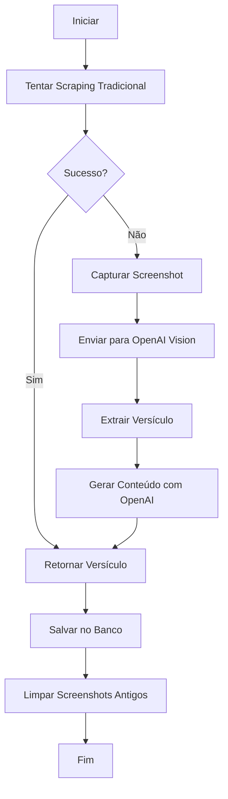

# Palavra do Dia - Screenshot + OpenAI Vision

## Visão Geral

Esta implementação usa uma abordagem inovadora para extrair a palavra do dia do site Bible.com:

1. **Screenshot**: Usa Puppeteer para capturar uma imagem da página
2. **OpenAI Vision**: Usa GPT-4 Vision para extrair o versículo da imagem
3. **OpenAI Text**: Gera devocional e oração personalizados em português

## Funcionalidades

### 🔧 Tecnologias Utilizadas

- **Puppeteer**: Para capturar screenshots da página web
- **OpenAI GPT-4 Vision**: Para extrair texto da imagem
- **OpenAI GPT-4o-mini**: Para gerar conteúdo devocional
- **Sharp**: Para processamento de imagens (se necessário)

### 📸 Processo de Screenshot

1. Abre um navegador headless (Puppeteer)
2. Navega para `https://www.bible.com/pt/verse-of-the-day`
3. Aguarda o carregamento completo da página
4. Captura screenshot da viewport
5. Salva a imagem temporariamente

### 🤖 Extração com OpenAI Vision

1. Converte a imagem para base64
2. Envia para OpenAI GPT-4 Vision
3. Extrai o versículo e referência bíblica
4. Retorna dados estruturados em JSON

### ✍️ Geração de Conteúdo

1. Usa o versículo extraído como base
2. Gera devocional contextualizado em português
3. Cria oração personalizada
4. Define duração estimada da oração

## Configuração

### Variáveis de Ambiente

```bash
# OpenAI API Key (obrigatório)
OPENAI_API_KEY="sua-chave-da-openai-aqui"

# Database URL
DATABASE_URL="sua-url-do-banco-aqui"
```

### Dependências

```bash
npm install puppeteer @types/puppeteer sharp openai
```

## Uso

### Teste Manual

```bash
npm run test:word-of-day
```

### Uso Programático

```typescript
import { wordOfDayService } from './services/wordOfDayService';

// Extrair versículo do dia
const verse = await wordOfDayService.scrapeVerseOfTheDay();

// Gerar conteúdo completo
const content = await wordOfDayService.generateContent(verse.verse, verse.reference);

// Criar palavra do dia completa
await wordOfDayService.createTodayWordOfDay();
```

## Estrutura de Arquivos

```
backend/
├── src/
│   ├── services/
│   │   ├── wordOfDayService.ts      # Serviço principal
│   │   └── screenshotService.ts     # Serviço de screenshot
│   └── scripts/
│       └── testWordOfDay.ts         # Script de teste
├── screenshots/                     # Screenshots temporários
└── package.json
```

## Fluxo de Dados



## Vantagens

✅ **Robustez**: Funciona mesmo com sites JavaScript complexos
✅ **Precisão**: OpenAI Vision é muito preciso na extração de texto
✅ **Flexibilidade**: Pode ser adaptado para outros sites
✅ **Conteúdo Dinâmico**: Sempre gera conteúdo novo e contextualizado
✅ **Fallback**: Tem múltiplas estratégias de recuperação

## Limitações

⚠️ **Dependência da OpenAI**: Requer chave de API válida
⚠️ **Custo**: Cada screenshot + análise consome tokens da API
⚠️ **Performance**: Mais lento que scraping tradicional
⚠️ **Recursos**: Requer mais memória para o navegador headless

## Monitoramento

### Logs

O serviço gera logs detalhados:

```
🔍 Getting verse of the day from Bible.com using screenshot...
🚀 Launching browser...
📸 Navigating to https://www.bible.com/pt/verse-of-the-day...
📷 Taking screenshot...
✅ Screenshot saved: /path/to/screenshot.png
🤖 Analyzing image with OpenAI Vision...
✅ Successfully extracted verse from image
🤖 Generating content with OpenAI...
✅ Successfully generated content with OpenAI
```

### Limpeza Automática

- Screenshots são automaticamente limpos
- Mantém apenas os 10 mais recentes
- Executa após cada operação

## Troubleshooting

### Erro: "OpenAI API key is required"
- Verifique se `OPENAI_API_KEY` está configurado no `.env`
- Obtenha uma chave em: https://platform.openai.com/api-keys

### Erro: "Failed to launch browser"
- Instale dependências do Puppeteer: `npx puppeteer browsers install chrome`
- No Linux: `apt-get install -y chromium-browser`

### Erro: "Could not extract verse"
- Verifique se o site está acessível
- Teste manualmente: `npm run test:word-of-day`
- Verifique os screenshots salvos em `backend/screenshots/`

## Próximos Passos

- [ ] Cache de versículos para evitar chamadas desnecessárias
- [ ] Suporte a múltiplos idiomas
- [ ] Integração com outros sites bíblicos
- [ ] Otimização de performance
- [ ] Métricas de uso e sucesso
